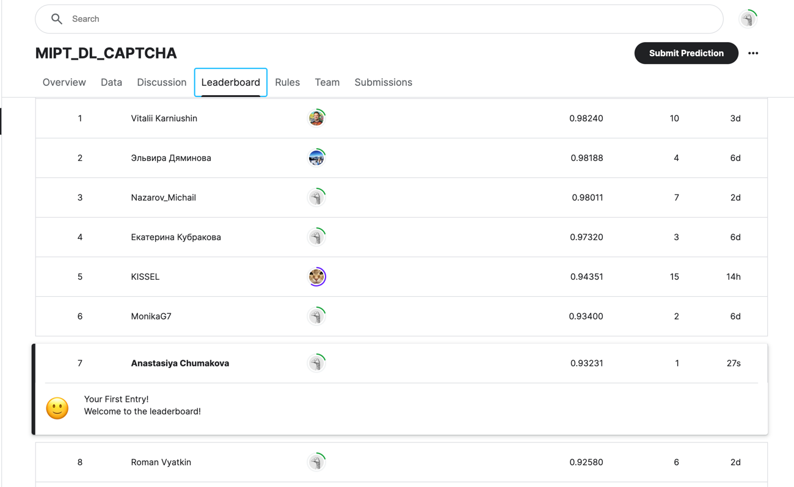

# Домашнее задание 2 (HW) | Соревнование на Kaggle

### Описание
В этом соревновании вам предлагается задача из области компьютерного зрения – распознавание букв английского алфавита на искаженных и зашумленных изображениях.
Данные для обучения содержатся в двух файлах: images.npy и labels.npy. Это формат numpy-массивов.

Всего доступно 20 тысяч размеченных изображений размером 48x48 с 3 цветовыми каналами (RGB), поэтому массив images имеет размер (20000, 48, 48, 3). В массиве labels содержатся ответы к тренировочному набору изображений. В английском алфавите 26 букв: 0-й класс соответствует букве А и так далее по алфавиту, 25-й класс — буква Z.

Ваша задача — обучить нейронную сеть и с ее помощью предсказать метки классов для изображений из файла images_sub.npy, в нем 50 тысяч изображений. Посмотрите на структуру файла sample_submission.csv — он не содержит полезных данных, а лишь описывает формат, в котором вы загружаете ваши предсказания на сайт. Создайте из ваших предсказаний такой же файл и загрузите в качестве вашего ответа (сабмита). Вы можете делать до 20 сабмитов в сутки.

Метрика лидерборда — accuracy, то есть доля правильно распознанных изображений.

Нотбук с базовым решением расположен в Google Colab. Попробуйте решить задачу, не обращаясь к нему. Задача будет считаться решенной, если в Public Leaderboard вы наберете score, который будет равен или больше 0.82.

### Форма сдачи результата:
В качестве результата пришлите скриншот турнирной таблицы и ссылку на блокнот.
### Скриншот турнирной таблицы

